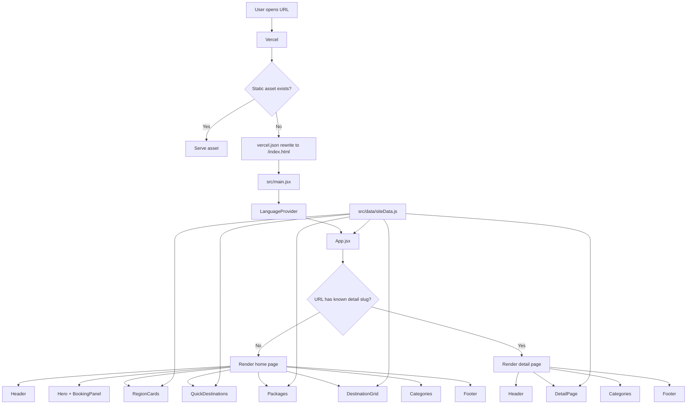
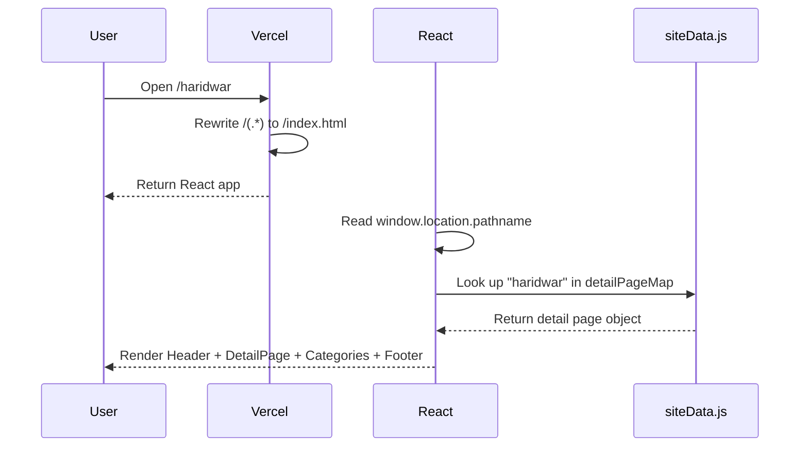
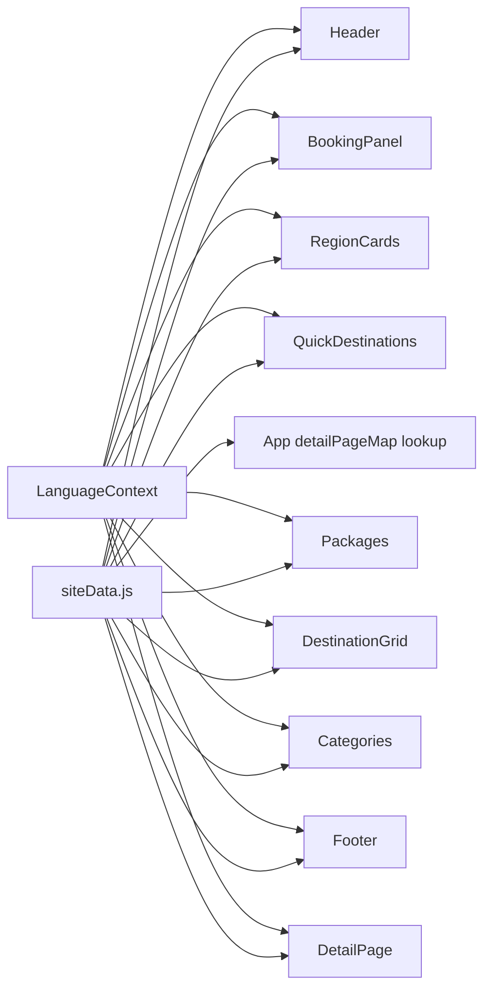

# Durga Tour and Travels - Component and Routing Guide

This document explains how the React front end works from local data to clickable cards, detail pages, and production deployment on Vercel.

## Full Pipeline



Important production point: Vite's dev server automatically falls back to `index.html`, but Vercel production does not unless `vercel.json` is present. That file is required for direct URLs like `/haridwar`, `/char-dham-yatra`, and `/kedarnath-dham-yatra-from-haridwar`.

## Component Tree

```text
src/main.jsx
└── LanguageProvider
    └── App
        ├── Home route: /
        │   ├── Header
        │   │   └── Brand
        │   ├── Hero
        │   │   └── BookingPanel
        │   ├── RegionCards
        │   ├── QuickDestinations
        │   ├── Packages
        │   │   └── PackageCard
        │   ├── DestinationGrid
        │   ├── Categories
        │   └── Footer
        │       └── Brand
        └── Detail route: /:slug
            ├── Header
            │   └── Brand
            ├── DetailPage
            ├── Categories
            └── Footer
                └── Brand
```

## File Map

| File | Purpose |
| --- | --- |
| `index.html` | Browser entry HTML. Loads React and the Google font links. |
| `vercel.json` | Production rewrite config. Sends direct SPA routes back to `/index.html`. |
| `src/main.jsx` | React entry point. Mounts the app and wraps it in `LanguageProvider`. |
| `src/App.jsx` | Top-level route switch. Renders the home page for `/`, or a detail page when the URL slug exists in `detailPageMap`. |
| `src/i18n/LanguageContext.jsx` | English/Hindi language state, translation helper, and persistence in `localStorage`. |
| `src/data/siteData.js` | Editable content data: site info, nav groups, search options, cards, packages, categories, slugs, and detail page content. |
| `src/components/DetailPage.jsx` | Reusable detail layout for About, Itinerary, and Tour Information. |
| `src/components/Header.jsx` | Top navigation bar, phone link, theme toggle, language toggle, and dropdown menus. |
| `src/components/Brand.jsx` | Shared logo and site name block used in header and footer. |
| `src/components/Hero.jsx` | Hero section and booking/search area wrapper. |
| `src/components/BookingPanel.jsx` | Package search and taxi enquiry forms. |
| `src/components/RegionCards.jsx` | Large featured region cards. |
| `src/components/QuickDestinations.jsx` | Short destination tiles with trip length and package counts. |
| `src/components/Packages.jsx` | Package cards and package section heading. |
| `src/components/DestinationGrid.jsx` | Popular destination grid and filter chips. |
| `src/components/Categories.jsx` | "What are you looking for?" section and trust/info panel. |
| `src/components/Footer.jsx` | Footer links and contact block. |
| `src/styles.css` | Layout, theme variables, responsive behavior, cards, detail page styling, and typography. |

## Routing Pipeline

The app uses lightweight client-side routing without `react-router`.



Current behavior:

- `/` renders the home page.
- `/:slug` renders a detail page only when the slug exists in `detailPageMap`.
- Unknown slugs currently fall back to the home page.
- Detail pages reuse the same `Header`, `Footer`, and `Categories` section.
- The middle detail content comes from `src/data/siteData.js`.

## Data Flow



## Detail Page Pipeline

Cards and nav items do not store page details directly. They only point to slugs.

```mermaid
flowchart LR
  A[Card data] --> B[slug field]
  B --> C[href="/slug"]
  C --> D[App.jsx reads pathname]
  D --> E[detailPageMap lookup]
  E --> F[DetailPage renders content]
```

Example card data:

```js
{ name: 'Haridwar', slug: 'haridwar', days: '2 Days', packages: '56+ Packages' }
```

That card links to:

```text
/haridwar
```

The actual page content comes from:

```js
detailPages -> detailPageMap.haridwar
```

## Key Components

### `main.jsx`

Bootstraps the app:

- imports `App`
- wraps it in `LanguageProvider`
- loads global styles
- mounts React into `#root`

### `App.jsx`

Makes the route-level render decision:

- reads `window.location.pathname`
- trims leading and trailing slashes
- looks up the slug in `detailPageMap`
- renders home sections when there is no matching detail page
- renders `Header`, `DetailPage`, `Categories`, and `Footer` when a detail page exists

Keep route-level composition here. Do not put package text or destination text in this file.

### `siteData.js`

This is the main editing file for content.

Editable zones:

- `siteInfo`
- `navGroups`
- `searchDestinations`
- `startingDestinations`
- `endingDestinations`
- `featuredRegions`
- `quickDestinations`
- `packages`
- `destinationFilters`
- `destinations`
- `categories`
- `detailPages`
- `detailPageMap`

Most future content changes should happen here.

### `DetailPage.jsx`

Reusable detail layout. It receives one `page` object from `detailPageMap`.

It renders:

- hero image
- title
- duration
- places covered
- About
- Itinerary
- Tour Information
- contact/help aside

Keep this component generic. Add new destination or package content in `siteData.js`.

### `Header.jsx`

The header handles:

- phone link
- custom tour action
- theme toggle
- language toggle
- main nav links
- dropdown menus

Some dropdown items map to detail pages through `navItemSlugs`. If a dropdown item has no matching detail page yet, it remains a placeholder `#` link.

### `RegionCards.jsx`

Large featured destination cards.

- data source: `featuredRegions`
- each item needs `title`, `slug`, and `image`
- each card links to `/${region.slug}`

### `QuickDestinations.jsx`

Compact destination tiles.

- data source: `quickDestinations`
- each item needs `name`, `slug`, `days`, and `packages`
- each tile links to `/${destination.slug}`

### `Packages.jsx`

Package cards.

Each card shows:

- package title
- duration
- places covered
- inclusions
- call button
- `View Detail` link
- traveler count

The package title and `View Detail` action both link to `/${item.slug}`.

### `DestinationGrid.jsx`

Popular destination tiles.

- data source: `destinations`
- each item needs `name`, `slug`, `packages`, and `popularity`
- each tile links to `/${destination.slug}`
- filter chips are visual only for now

### `Categories.jsx`

The shared "What are you looking for?" section.

This appears on:

- home page
- detail pages

### `Footer.jsx`

Footer contains:

- brand
- quick links
- contact phone
- location

Footer links use absolute hash URLs such as `/#packages` so they still work when the user is on `/haridwar`.

## Adding a New Detail Page

Use the same slug in the visible card data and the detail page data.

1. Add or update an item in `featuredRegions`, `quickDestinations`, `packages`, or `destinations`.
2. Give it a `slug`.
3. Add a matching `createDetail(...)` entry in `detailPages`.
4. Add translations in `LanguageContext.jsx` for new visible text if Hindi support is needed.
5. Run `npm run build`.

Example quick destination:

```js
{ name: 'Mussoorie', slug: 'mussoorie', days: '3 Days', packages: '5+ Packages' }
```

Example detail page:

```js
createDetail(
  'mussoorie',
  'Mussoorie',
  'Sample Mussoorie details with local sightseeing and private cab support.',
  'https://example.com/image.jpg',
  { duration: '3 D / 2 N', places: 'Dehradun, Mussoorie' },
)
```

Working URL:

```text
/mussoorie
```

## Production Deployment on Vercel

`vercel.json` must stay in the repository:

```json
{
  "rewrites": [
    {
      "source": "/(.*)",
      "destination": "/index.html"
    }
  ]
}
```

Why it matters:

- Local Vite dev server serves `index.html` for `/haridwar`.
- Vercel production looks for a real `/haridwar` route or file.
- The rewrite tells Vercel to serve `index.html`.
- React then reads the URL and renders the right detail page.

## Styling Notes

`src/styles.css` owns:

- layout
- responsive behavior
- theme variables
- light/dark mode
- top bar alignment on small screens
- section spacing
- card styling
- detail page typography
- `View Detail` button contrast

The app uses CSS variables for theme colors. The body/UI font is `Manrope`, and detail-page reading content uses `Lora`.

## Current Render Order

```text
Home route /
  Header
  Hero
  RegionCards
  QuickDestinations
  Packages
  DestinationGrid
  Categories
  Footer

Detail route /:slug
  Header
  DetailPage
  Categories
  Footer
```

That is the current render order in `App.jsx`.
