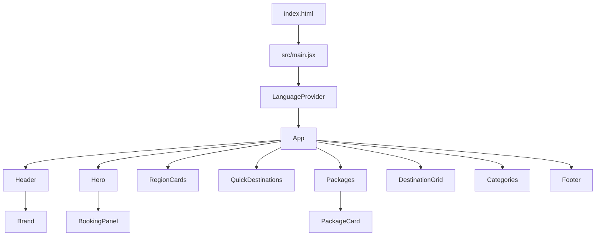
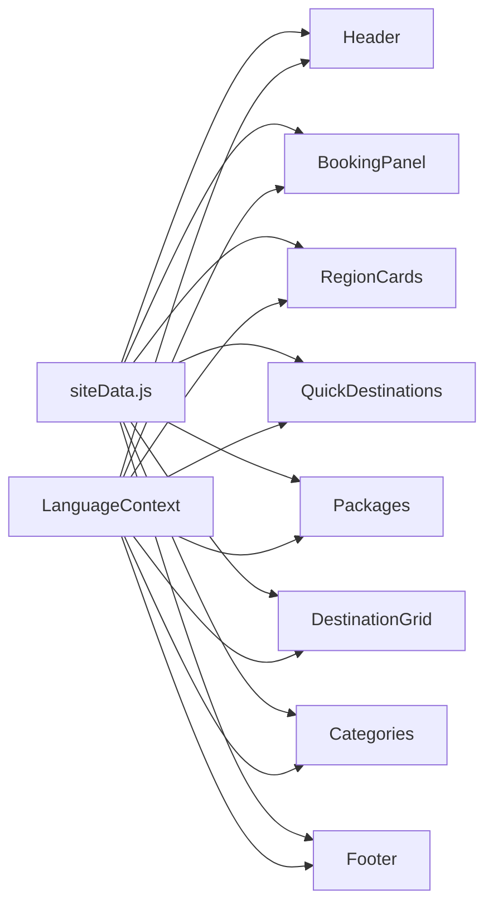

# Durga Tour and Travels - Component Diagram and Explanation

This document explains the React front end in a diagram-first way so the structure is easy to modify later.

## High-Level Flow



## Component Tree

```text
src/main.jsx
└── LanguageProvider
    └── App
        ├── Header
        │   └── Brand
        ├── Hero
        │   └── BookingPanel
        ├── RegionCards
        ├── QuickDestinations
        ├── Packages
        │   └── PackageCard
        ├── DestinationGrid
        ├── Categories
        └── Footer
            └── Brand
```

## File Map

| File | Purpose |
| --- | --- |
| `src/main.jsx` | React entry point. Mounts the app and wraps it in the language provider. |
| `src/App.jsx` | Page composition only. Keeps the order of sections. |
| `src/i18n/LanguageContext.jsx` | English/Hindi language state, translation helper, and persistence in `localStorage`. |
| `src/data/siteData.js` | Editable content data: phone number, nav groups, destinations, packages, categories, and route options. |
| `src/components/Header.jsx` | Top navigation bar, phone link, theme toggle, language toggle, dropdown menus. |
| `src/components/Brand.jsx` | Shared logo + site name block used in the header and footer. |
| `src/components/Hero.jsx` | Hero section and the booking/search area wrapper. |
| `src/components/BookingPanel.jsx` | Package search and taxi enquiry forms, including `From` and `To` dropdowns. |
| `src/components/RegionCards.jsx` | Large featured region cards. |
| `src/components/QuickDestinations.jsx` | Short destination tiles with trip length and package counts. |
| `src/components/Packages.jsx` | Package cards and package section heading. |
| `src/components/DestinationGrid.jsx` | Popular destination grid and filter chips. |
| `src/components/Categories.jsx` | Travel category chips and trust/info panel. |
| `src/components/Footer.jsx` | Footer links and contact block. |
| `src/styles.css` | All layout, color, responsive, theme, and component styles. |

## Data Flow Diagram



## Detailed Component Explanation

### `main.jsx`

This file is the bootstrapping layer.

- Imports the root `App`
- Wraps the app in `LanguageProvider`
- Loads global styles
- Mounts React into `#root`

It should stay small. If more app-wide providers are added later, they belong here.

### `LanguageContext.jsx`

This file controls English/Hindi switching.

- Stores the current language in React state
- Persists the selection in `localStorage`
- Updates the document language attribute
- Exposes a `t(text)` helper that returns Hindi text when Hindi is active

This is the right place to expand translation coverage later.

### `App.jsx`

This file only defines page composition.

- No business logic
- No data definitions
- No UI branching

It is the top-level structural map of the page.

### `Header.jsx`

The header handles:

- phone link
- custom tour action
- theme toggle
- language toggle
- main nav links
- dropdown menus

The header uses the shared `Brand` component so the logo stays consistent with the footer.

### `Brand.jsx`

The brand block shows:

- the generated logo image
- the site short name
- the tagline

It is shared between header and footer so branding stays consistent.

### `Hero.jsx`

The hero section contains:

- the large page headline
- supporting copy
- call-to-action buttons
- the booking panel below it

This is the first full-screen section users see after the nav.

### `BookingPanel.jsx`

This is the main inquiry UI.

- `Packages` / `Hotels` / `Book Taxi` tabs
- package search row
- taxi enquiry row
- separate `From` and `To` dropdowns

The dropdown lists come from `siteData.js`, so they can be edited without touching component code.

### `RegionCards.jsx`

This section shows the large destination highlight cards.

- uses image assets from `siteData.js`
- intended for high-visibility featured destinations

### `QuickDestinations.jsx`

This section is a compact grid for fast browsing.

- destination name
- trip length
- package count

Add or remove quick destinations in `siteData.js`.

### `Packages.jsx`

This section renders the travel package cards.

Each card shows:

- package title
- duration
- places covered
- inclusions
- call button
- detail button
- traveler count

The first three cards use AI-generated local assets saved in `src/assets/`.

### `DestinationGrid.jsx`

This section presents broad destination options with filter chips.

- filter buttons at the top
- destination tiles below

The current filters are visual only. They can be wired to real filtering later.

### `Categories.jsx`

This section shows travel intent categories such as:

- family
- honeymoon
- adventure
- pilgrimage

The right-side panel is a trust/info block for package and taxi enquiries.

### `Footer.jsx`

The footer repeats the brand and shows:

- quick links
- contact phone
- location

It uses the same translated text system as the rest of the app.

## Editable Data Zones

If you want to change content later, start here:

- `siteInfo`
- `navGroups`
- `searchDestinations`
- `startingDestinations`
- `endingDestinations`
- `featuredRegions`
- `quickDestinations`
- `packages`
- `destinationFilters`
- `destinations`
- `categories`

That file is the safest place to add, remove, or rename travel content.

## Assets

Current local assets live in:

- `src/assets/logo/`
- `src/assets/travel/`

Those files are imported directly by `siteData.js` and `Brand.jsx`.

## Styling Notes

`src/styles.css` owns:

- layout
- responsive behavior
- theme variables
- top bar alignment on small screens
- section spacing
- card styling

The light and dark themes are driven by CSS variables, so the app can switch without duplicating component markup.

## How to Extend

1. Add new content in `src/data/siteData.js`.
2. Reuse an existing component if the data fits its current shape.
3. Create a new component only when the section has a different layout or behavior.
4. Keep translations in `LanguageContext.jsx` in sync with any new visible text.

## Current Page Order

```text
Header
Hero
RegionCards
QuickDestinations
Packages
DestinationGrid
Categories
Footer
```

That is the current render order in `App.jsx`.
